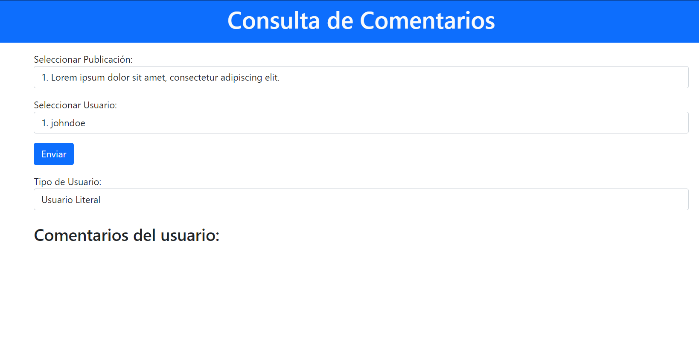
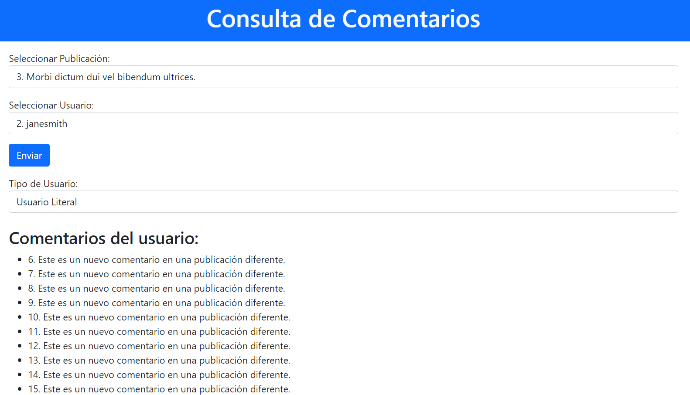

# Consulta de Comentarios - Ejercicio 5 Relación4_POO_Prototipos

**Este proyecto es un buscador de comentarios en el cual puedes elegir una publicación y un usuario y ver sus comentarios en dicha publicación.**

## Comenzando 🚀

### Vista de la página 👀

### Pre-requisitos 📋

- [Node.js](https://nodejs.org/)
- [npm](https://www.npmjs.com/)

### Instalación 🔧

Una vez posicionado en la carpeta del ejercicio es necesario instalar las dependencias con `npm install` o `pnpm install`

## Pruebas ⚙️
Vemos que aparecen los comentarios del usuario 2 en la publicación 3

## Construido con 🛠️

* HTML
* JavaScript
* [Boostrap 5](https://getbootstrap.com)

## Autor ✒️

**Pedro Vílchez Peña 2ºDAW**

